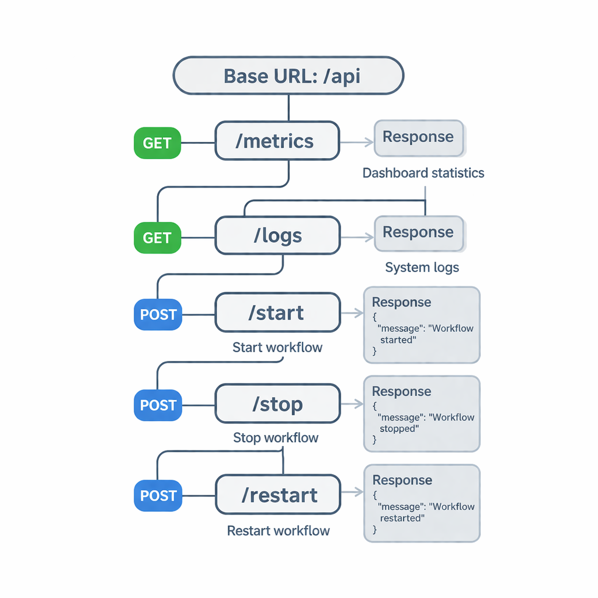

# API Structure - AI Monitoring Dashboard

## Overview
The backend provides REST APIs to fetch analytics data, logs, and control AI workflows.

---

## API Diagram



---

## Base URL
http://localhost:5000

---

## Endpoints

### 1. Get Dashboard Metrics
**Endpoint:** GET /api/metrics  
**Description:** Returns dashboard statistics  

**Response:**
```json
{
  "totalRequests": 1200,
  "successRate": 95,
  "errorRate": 5
}