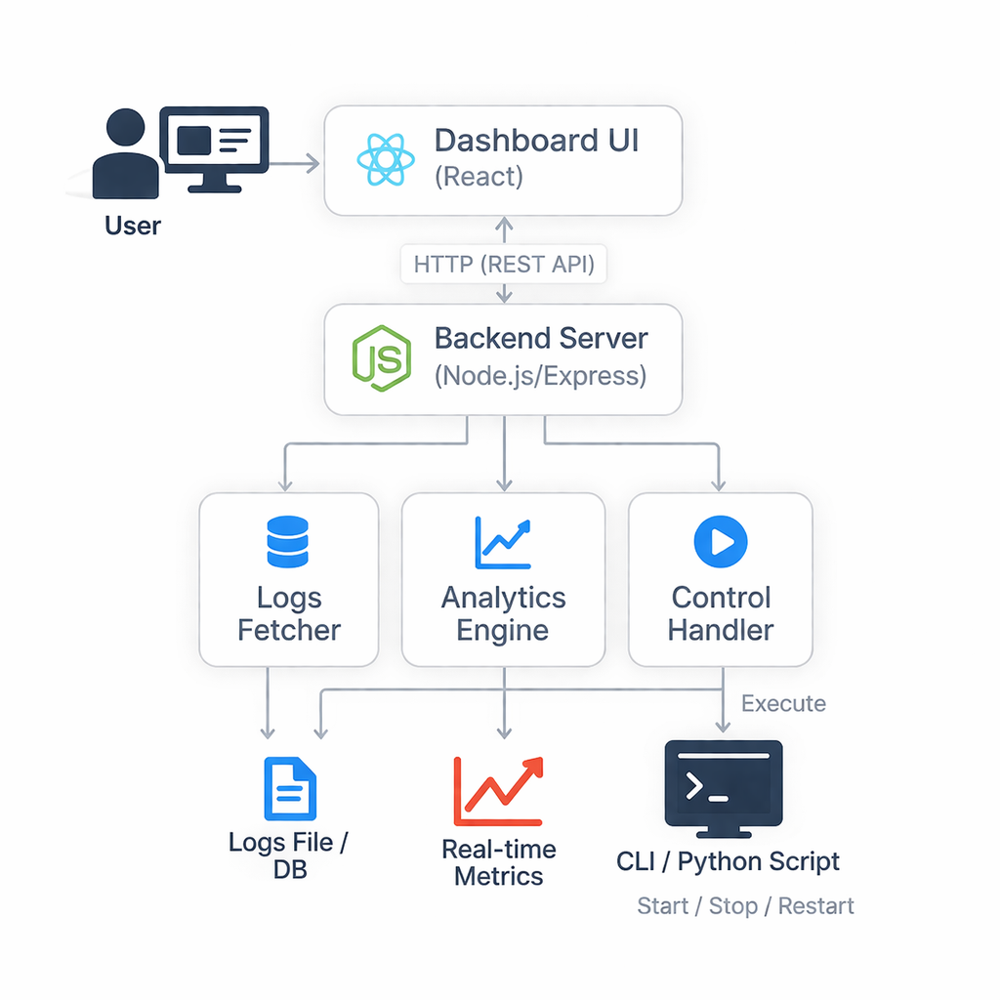

# System Architecture - AI Monitoring Dashboard

## Overview
The AI Web Dashboard follows a client-server architecture where the frontend interacts with a backend API to display real-time analytics, logs, and control AI workflows.

---

## Architecture Diagram

---

## Components

### 1. Frontend (React)
- Built using React.js
- Displays dashboard UI, charts, logs, and control panel
- Communicates with backend via HTTP APIs

---

### 2. Backend (Node.js)
- Built using Node.js and Express
- Provides REST APIs
- Handles:
  - Logs generation
  - Analytics data
  - Workflow control actions (start/stop/restart)

---

### 3. Data Layer (Mock Data)
- Simulated logs and analytics
- No real database used
- Used for demonstration purposes

---

## Data Flow

1. User opens dashboard
2. Frontend sends request to backend
3. Backend returns logs and analytics
4. Frontend displays:
   - Metrics
   - Graphs
   - Logs
5. User clicks control buttons
6. Backend updates status and logs

---

## Key Features Supported

- Real-time updates (simulated)
- Dashboard analytics
- Logs monitoring
- Workflow control (Start / Stop / Restart)

---

## Technology Stack

- Frontend: React.js
- Backend: Node.js (Express)
- Charts: Chart.js
- Styling: CSS / Tailwind