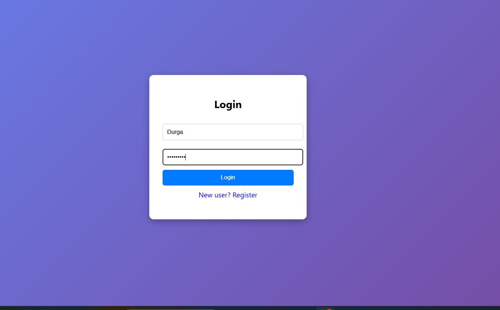
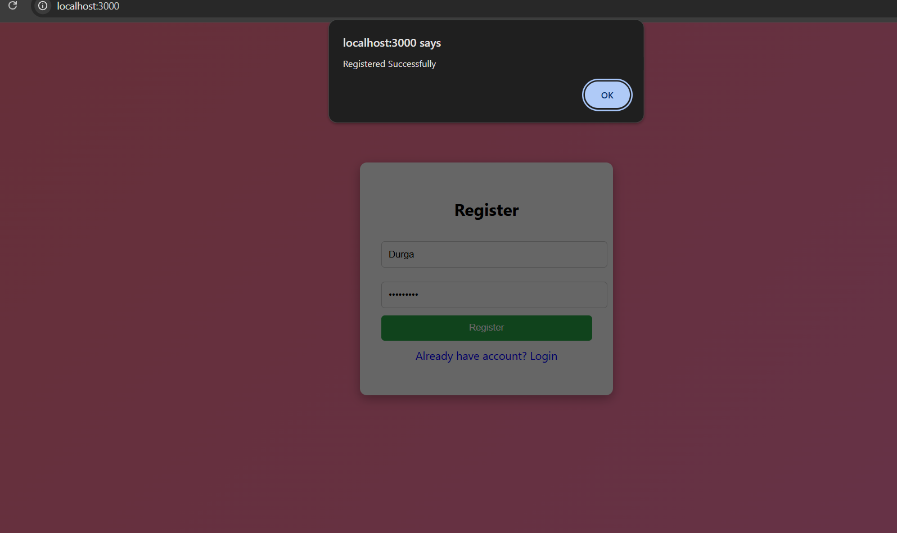
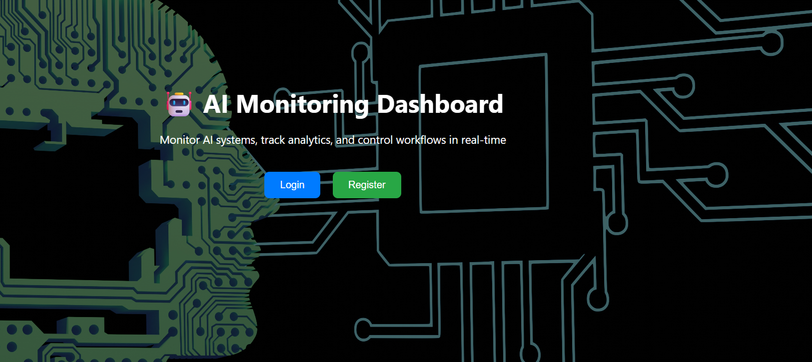

# UI Wireframes - AI Monitoring Dashboard

**Note:** Instead of only static sketches, I have implemented the UI and provided actual screenshots of the working application. This demonstrates both design and functionality.

---

## 1. Login Screen

- Centered login form  
- Username & password input  
- Simple and clean UI  

---

## 2. Register Screen

- User registration form  
- Displays success message after signup  

---

## 3. Main Dashboard

- Header with welcome message and logout  
- Metrics cards:
  - Total Requests  
  - Success Rate  
  - Error Rate  

---

## 4. Analytics Chart

- Real-time performance graph  
- Displays system activity trends  

---

## 5. Logs Section

- Live logs with timestamps  
- Status indicators:
  - Success ✅  
  - Error ❌  
  - Restart 🔄  

---

## 6. Control Panel

- Start, Stop, Restart buttons  
- Controls backend workflows  
- Actions reflected in logs  

---

## Initial Concept Sketch (Optional)

This was the initial layout idea. The final implementation improves structure and adds more features like Control Panel and real-time updates.

---

## Overall Layout

- Header  
- Metrics Cards  
- Analytics Graph  
- Logs Section  
- Control Panel  

The dashboard is designed to monitor AI workflows with real-time updates and control features.